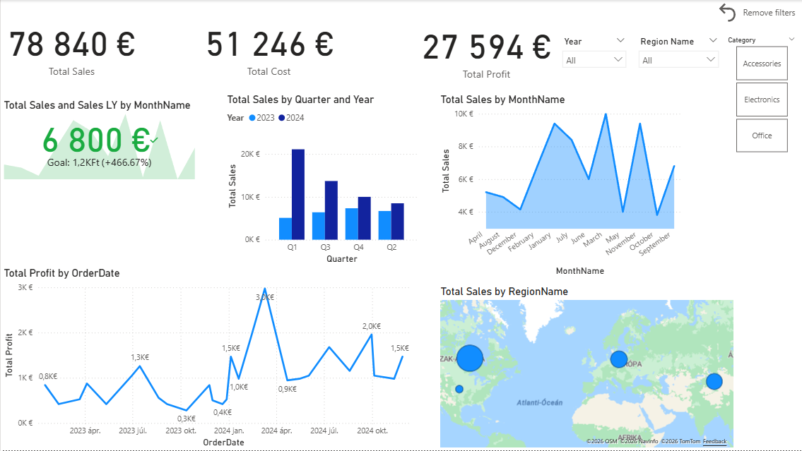
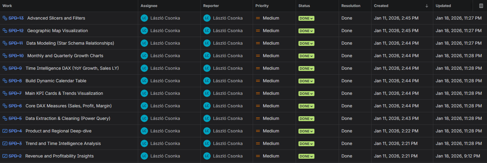

# 📊 Sales & Profitability Business Intelligence Dashboard

## 📌 Project Overview
This project is a comprehensive Business Intelligence solution designed to analyze retail sales performance. It transforms raw data into actionable insights using a professional **Star Schema** data model, advanced **DAX** calculations, and interactive visualizations.

---

## 🛠️ Tech Stack & Skills
* **Tool:** Power BI Desktop
* **Data Modeling:** Star Schema (Fact and Dimension tables)
* **Languages:** DAX (Data Analysis Expressions), Power Query (M)
* **Database Knowledge:** SQL (for data preparation logic)
* **Project Management:** Managed via **Jira** (Agile/Scrum)

---

## 🏗️ Data Architecture
The report is built on a robust data model including:
* **Fact_Sales:** Contains transaction-level data.
* **Dim_Products, Dim_Regions, Dim_Customers:** Descriptive attributes for deep-dive analysis.
* **Dim_Calendar:** A custom-built DAX calendar table for **Time Intelligence** (YoY, Sales LY).

---

## 🚀 Key Features
* **Dynamic KPIs:** Real-time calculation of Total Sales, Profit, and Profit Margin.
* **Geographical Analysis:** Azure Maps integration to visualize regional performance.
* **Time Intelligence:** Comparison of current performance against previous periods (Year-over-Year).
* **Advanced UX:** Bookmark-based "Reset Filters" button and custom Slicer layouts for seamless navigation.

---

## 📉 Project Management (Agile)
The development was structured into 3 main Sprints/Stories in **Jira**:
1.  **SPD-2:** Revenue and Profitability Insights (Core Setup & DAX).
2.  **SPD-3:** Trend and Time Intelligence Analysis (Calendar & YoY).
3.  **SPD-4:** Product and Regional Deep-dive (Mapping & Advanced Filters).

---

## 📸 Screenshots

### Dashboard Overview

### Jira Project Tracking (All Tasks Completed)

---

## 💾 SQL Implementation
As a developer with 4 years of MSSQL experience, I designed the data layer to be "database-ready". You can find the SQL view definitions in the `/sql` folder of this repository.
